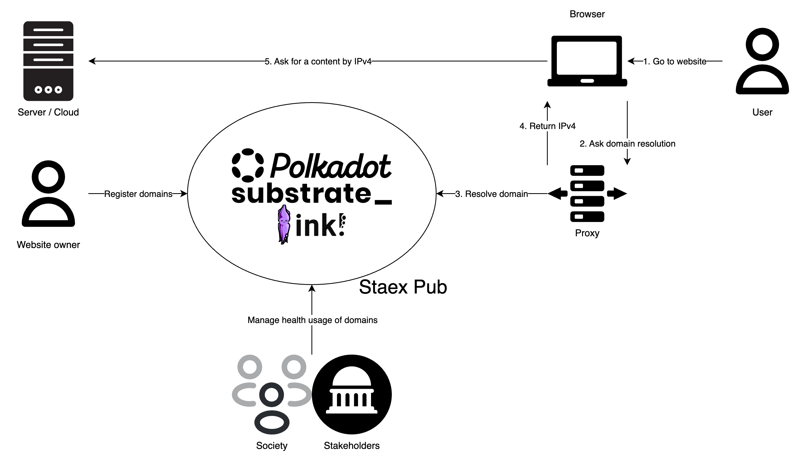

# 📝 StaexPub: The Internet for Web3

## 🌟 Project Overview

### Brief description

The mission of Staex public network (StaexPub for short) is to provide universal worldwide access to crypto and Web3 services, bypassing legacy centralized Internet technologies. Staex uses decentralized governance based on economic incentives instead of the governance via state-funded organizations that the current Internet infrastructure is based on. StaexPub runs on top of the Internet, however, it doesn’t rely on any of the legacy technologies except for IP networking and provides fully decentralized Web3-based alternatives to Internet registrars, DNS providers, and certificate authorities. The ultimate objective is to bring Internet registrars into the Web3 economy that will provide their services at global scale without relying on centralized organizations like IANA.

### Why Polkadot?

The fact that Web3 services are accessed via legacy Web2 Internet infrastructure is an issue that is more and more often brought up by the community. While there are a number of projects that focus on decentralized identifiers (e.g. Kilt on Polkadot), only a few focus on name services (e.g. ENS and eth.limo on Ethereum). and we could not find any that provide alternatives to legacy DNS and certificate authority (CA) systems in terms of decentralized governance and operating system integration. We believe that merely providing a registry of unique names is not enough: Web3 needs underlying infrastructure that is publicly and transparently accessible by the standard Internet browsers and is openly governed by its stakeholders. Our project aims to fill this gap and provide a Web3 version of Internet registrars and certificate authorities implemented as smart contracts (and, in the perspective, DAOs). Polkadot is already the basis of many chains and parachains, and we believe that Polkadot is a great fit to provide such foundational services on top and to become the backbone of the Web3 Internet.

### 🔍 Project Details

#### Overview

In this project we are focused on creating an MVP. The system will allow anyone to

* register their own Web3 domain via a smart contract,  
* resolve names via a local DNS resolver (that pulls the data from the blockchain) using legacy DNS queries to seamlessly integrate with browsers and other tools, and  
* generate the current list of SSL certificates based on the data from the blockchain via an utility program running locally on the client’s node.

The names will be under a unique top-level domain to not interfere with the existing Internet names. Each name is signed by the private key of the owner and is registered in a form of SSL certificate. The locally running client (that bundles local DNS resolver and CA) will allow users to filter the public keys that they trust to browse their own slice of the Internet.

To scale this approach to a large number of names/hosts we plan to introduce registrars as intermediaries. They will check that the user actually owns the IP address via a cryptographic challenge, then add their signature to the certificate and send it to the smart contract. Once the majority of registrars sign the certificate the name becomes trusted automatically. Also, the registrars will decide what sites pose a threat to the network economy (e.g. malware) and need to be deregistered.

The network with registrars will provide a number of advantages over the existing Internet. New top-level domains would be much easier to register — a matter of the consensus between the registrars. No reliance on government entities for establishing trust. DNS-based attacks (e.g. data exfiltration, poisoning) will be rendered impossible by the use of the blockchain and local resolver.

<i>In the subsequent iterations of the project we plan to integrate name resolution directly into the client’s software (e.g. via a browser plugin or OS-specific library) to eliminate the need for a user to run a local DNS resolver and certificate authority. We also plan to replace legacy IP addresses with public keys as a means of protecting from censorship and provide an overlay network to route such addresses: we already have such a network implemented (this is Staex main product) but it is not a vital part of this project in the initial stage.</i>

#### Components

* `staex-smart` — smart contracts that implement domain management, registrar management, and other utility functions.  
* `staex-web` — DAPP that provides Web UI for the smart contracts (domain registration and other functions).  
* `staex-local` — local DNS resolver and certificate authority that sources its data from the smart contracts’ storage.

#### Smart contracts (`staex-smart`)

We will implement smart contracts in the ink\! programming language. They will use an ERC-20/PSP-22 token for transactions.

##### Registering a domain (`domain` call)

- The user calls a smart contract with the following parameters.  
  - Signed TLS-like certificate which contains  
    - FQDN of the domain name,  
    - IPv4/IPv6 addresses of the server,  
    - start date (no later than in a year),  
    - expiration date (no later than in a year, no sooner than in a month).  
  - A wallet address to which the domain should be transferred when expired (none by default). By this time that wallet should submit its own domain registration request for the transfer to happen.  
- Users should, in addition to the domain price, send an appreciative amount of tokens which will be locked until domain expiration date.

##### Updating/deregistering/transferring a domain

Same as domain registration but supply a different expiration date, e.g. the current date to deregister a domain. The locked tokens are returned to the owner. The owner can also claim locked tokens via a separate `claim` call if the domain has expired by itself.

##### Domain revocation (`revoke` call)

<i>
A domain may be revoked (forcefully deregistered) if registrars decide that it poses a threat to the economy of the network.

- Any user can propose domain revocation.  
- When a user makes a proposal, he/she sends tokens and locks them until the revocation decision is finalized.  
- Stakeholders should make a decision about domain revocation.  
  - If the majority of the registrars (50% \+ 1\) vote for, the domain is revoked.  
    - User’s tokens (who made a proposal) should be unlocked.  
    - All tokens which were locked during the offending domain registration are distributed between the registrars who voted for (10%) and the person who made the proposal (5%), the rest are burned (85%).  
  - If the majority of the registrars (50% \+ 1\) vote against, the domain is not revoked.  10% of the tokens which were locked during the proposal request are sent to the registrars who voted against, 90% of tokens are burned.  
  - If enough votes are not collected until the proposal expires, the domain is not revoked. 10% of the tokens which were locked during the proposal request are sent to the registrars who voted against, 90% of tokens are burned.
</i>

##### Becoming a registrar (`registrar` call)

<i>
Registrars are intermediaries that check that users actually own the IP addresses for which they register domain names and get a reward for doing that. They also participate in network governance. At the current stage of the project though the registrars only participate in domain revocation.

- A user locks tokens (simply sends tokens to the smart contract) to become a registrar.  
- A user unlocks tokens (send tokens from the smart contract to the user) to stop being a registrar.
</i>

#### Domain name pricing

Domain name price decreases exponentially with respect to the name length and is proportional to the length of the registration period.

#### DAPP (`staex-web`)

To provide easy to use access to the economy, we will prepare web UI with the following pages.

1. Domain page (register/update/show a domain).  
2. A page where locked tokens can be claimed.

#### Local DNS resolver and CA (`staex-local`)

To make it possible for domain resolving from general users on their personal computers, we will prepare a local DNS resolver and CA (certificate authority) that pulls the data from the blockchain. Name resolution is done via legacy DNS protocol and CA certificate bundle is generated on-the-fly using the data from the blockchain. Untrusted and expired domains are resolved to `NXDOMAIN`.

#### Limitations

Developing registrar-related software that validates the ownership of the domain as well as registrar-related smart contract calls is out of scope of this grant.

### 🧩 Ecosystem Fit

#### Target audience

Our target audience at large is Internet registrars and web site administrators, however, at first we will focus on Web3 enthusiasts and privacy advocates who would love to leave as little personal data as is possible in the databases of Internet registrars. With StaexPub they will have full custody of their domains while leaking zero personal data.

#### Similar projects

While there are existing projects that can be considered building blocks of Internet infrastructure (e.g. Kilt, PolkaIdentity), they are focused on decentralized identities. Our project is specifically focused on Internet domain names and the integration with the existing Internet ecosystem — we want Web3 domain names to actually be resolvable in the browser.

## 👥 Team

- **Team Name:** Staex / Staex GmbH.  
- **Contact Name:** Sergei Lavrentev.  
- **Contact Email:** [sergei@staex.io](mailto:sergei@staex.io)  
- **Website:** [https://github.com/staex-io/](https://github.com/staex-io/)

### Team members

- Sergei Lavrentev (software engineer).  
- Maksim Sukhotin (software engineer).  
- Ivan Gankevich (technical advisor).

#### LinkedIn Profiles (if available)

- [https://www.linkedin.com/in/lavrdx/](https://www.linkedin.com/in/lavrdx/)  
- [https://www.linkedin.com/in/max-sukhotin/](https://www.linkedin.com/in/max-sukhotin/)  
- [https://www.linkedin.com/in/ivan-gankevich/](https://www.linkedin.com/in/ivan-gankevich/)

### Team Code Repos

- [https://github.com/staex-io/](https://github.com/staex-io/)

GitHub accounts of all team members:

- [https://github.com/lavrd](https://github.com/lavrd)  
- [https://github.com/msukhotin](https://github.com/msukhotin)  
- [https://github.com/igankevich](https://github.com/igankevich)

### Team's experience

Our team has huge experience in the IoT infrastructure field. As a part of projects from T-Labs (Deutsche Telekom) and Staex, we were able to implement orchestrators for Blockchain networks, distributed networks and currently VPN with IoT focus. [https://staex.io/product](https://staex.io/product)

Some of our Web3 projects:

- EMF \- the goal of this project is to digitize and automate certification of cell towers’ compliance with regulations related to electromagnetic field (EMF) radiation levels. The project was done with Web3 Foundation. [https://github.com/staex-io/emf](https://github.com/staex-io/emf)   
- Vehicle Tracking System \- infrastructure to track and invoice vehicles. The goal of this project is to develop trusted, transparent and automatic infrastructure to use, rent and track vehicles by different entities. [https://github.com/staex-io/vts](https://github.com/staex-io/vts) 

## 📊 Development Status

Staex's main product is a blockchain-inspired VPN that uses public keys of the nodes as their DNS names and dynamically resolves them into locally-generated IP addresses (human-readable names also work). Each name is signed by the user’s certificate, and name resolution is integrated into the software. This allows anyone to create their own and private version of the Internet, i.e. to fully control routing, addresses and name resolution.

The current project represents the evolution of this idea to the *public* blockchain-based Internet and the pivot of the company into the Web3 space. The main objective is to create smart contracts that will govern such a network via economic incentives and integrate them with the software running on the users’ devices. This project will not use any of the Staex intellectual property or products, all code will be open source and unencumbered by the patents.

## 📅 Development Roadmap

### Overview

- **Estimated Duration:** 2 months  
- **Full-Time Equivalent (FTE):** 25% FTE.  
- **Total Costs:** $10,000 USD

| Number | Deliverable | Specification |
| ----: | :---- | :---- |
| 0a. | License | Apache 2.0 / MIT |
| 0b. | Documentation | (1) Inline documentation for smart contracts. (2) Detailed CLI documentation for `staex-local` (via `--help`). (3) Overall tutorial for `staex-local` in the form of a README file. |
| 0c. | Testing and Testing Guide | (1) Unit tests for core functions of smart contracts. (2) CI scripts that run these tests. |
| 0d. | Article | We will publish an **article** that explains what was done/achieved as part of the grant on Staex web site and the accompanying posts on social media. |
| 1\. | `staex-smart` | Smart contract that implements (1) domain registration, deregistration, transfer, update (`domain` call), (2) claiming locked tokens (`claim` call). |
| 2\. | `staex-web` | A DAPP that provides UI for the smart contract. (1) Domain page (register/update/show a domain). (2) A page where locked tokens can be claimed. |
| 3\. | `staex-local` | Local DNS resolver and certificate authority that pulls the data from the smart contract. |

### 💰 Budget Breakdown

| Milestone | Deliverables | Cost (USD) | Estimated Completion |
| :---- | :---- | :---- | :---- |
| 1 | Smart contracts (`staex-smart`), tests, documentation. Deliverables: 0a, 0b, 0c, 1. 40 hours of an FTE at $125 / hour. | $5,000 | 1 month |
| 2 | DAPP (`staex-web`), local DNS resolver and CA (`staex-local`), the article. Deliverables: 0d, 2, 3  40 hours of an FTE at $125 / hour. | $5,000 | 1 month |
| **Total** |  | **$10,000** | **2 months** |

## 🔮 Future Plans

We plan to apply for an Open Source Developer grant and seek additional funding from VCs once the project matures. Development-wise we plan to on-board registrars when the project gains sufficient traction and focus our efforts on decentralized governance (via a DAO) through which the registrars/stakeholders will have influence on the project. In perspective we see our project as the go-to solution for getting Web3 domain names and accessing sovereign web openly governed by its stakeholders via economic rather than political incentives.
