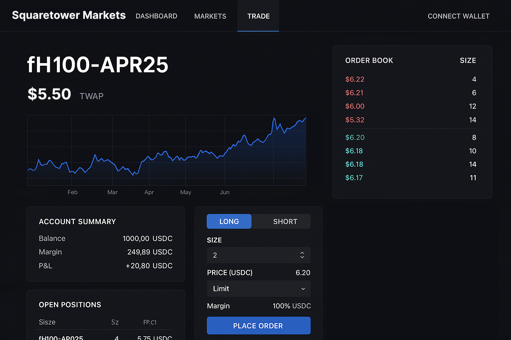

# 📝 Squaretower Markets

## 🌟 Project Overview

*A trading platform to trade synthetic GPU compute hours.*

Squaretower Markets is a synthetic derivatives platform enabling speculation and hedging on the price of on-demand GPU compute, starting with H100s. The first version of the platform offers cash-settled futures contracts denominated in USDC, designed for AI startups, GPU renters, retail traders, and trading firms (to hedge, gain exposure, or speculate) without requiring delivery of real compute. By creating a new asset class, Squaretower Markets creates new information about the AI economy.

In future phases, sGPU Futures could migrate critical infrastructure such as staking logic, perpetual funding rates, and margin contracts to a Polkadot parachain or smart contracts using ink!. Additionally, integration with Polkadot-native oracle pallets or compute subnets (e.g., Bittensor) is a logical extension of the platform's vision. Polkadot is a growing ecosystem, and we hope to utilize Polkadot functionality for our initial futures orderbook.

GPU access is one of the most valuable resources in AI development. In addition, AI compute pricing is volatile and heavily subject to market events. By introducing price discovery and speculative tools around GPU compute pricing, we enable decentralized infrastructure participants to hedge volatility, while giving traders a new DeFi-native synthetic primitive. Financial instrumentation around compute as a commodity is in demand.

### 🔍 Project Details

Instead of starting with an actual synthetic token, we will start with monthly or bimonthly futures contracts, allowing users to take long/short positions that are settled for USDC at contract expiry based on the TWAP price according to the index at expiry. There will be no delivery of real GPU compute hours.

- Stack: Next.js, FastAPI (Python), PostgreSQL
- Infra: Dockerized microservices, deployed on Vercel/Render/self-hosted Coolify, custodial wallets for each user with fiat on-ramp and off-ramp
- Matching engine: Centralized orderbook, executing transactions on-chain (trades between users/wallets and the central wallet, then vice versa at settlement) to maintain a public ledger

We plan to open source our orderbook/matching engine and transaction infra built on Polkadot.

We are currently building out the centralized orderbook right now. We have a centrally-maintained price index as our oracle, which updates a public TWAP price index from on-demand H100 providers such as Prime Intellect, Lambda Labs, and SF Compute (soon to be deployed). Here is a mockup of the trading platform:

See [https://squaretower.xyz/markets](https://squaretower.xyz/markets) for more.

### 🧩 Ecosystem Fit

Synthetic assets + DeFi primitives built around real-world AI infrastructure markets. One of the first trading platforms (to our knowledge) built on Polkadot.

Our target audience is AI startups renting compute (to hedge costs and provide financial engineering services for AI training), retail traders interested in GPU speculation, and GPU providers/data centers looking to hedge usage.

Right now, there is no real way for trading firms or other interested parties to take action on the “AI economy” in a way directly tied to an underlying asset. We believe that compute hours are the base unit of the future AI economy, and we hope to provide seamless financial instruments around the ecosystem. In addition, GPU providers face a liquidity problem — as soon as an interested buyer wants to buy compute, they must use it immediately or the hour is expired. By implementing a synthetic market, we can better move money around the compute market. We can also help close the loop between AI demand and the crypto market structure.

## 👥 Team

- **Team Name:** Squaretower Markets
- **Contact Name:** Mackay Grant
- **Contact Email:** mail@mackaygrant.com
- **Website:** [https://squaretower.xyz/markets](https://squaretower.xyz/markets)

### Team members

- Neha Desaraju
- Mackay Grant

#### LinkedIn Profiles (if available)

- [https://www.linkedin.com/in/nehadesaraju](https://www.linkedin.com/in/nehadesaraju)
- [https://www.linkedin.com/in/mackaygrant](https://www.linkedin.com/in/mackaygrant)

### Team Code Repos

[https://github.com/squaretower](https://github.com/squaretower) (public repos coming soon)

Please also provide the GitHub accounts of all team members:

- [https://github.com/estaudere](https://github.com/estaudere)
- [https://github.com/0xmgg](https://github.com/0xmgg)

### Team's experience

Neha and Mackay have extensive experience in systems architecture, trading systems, and AI infrastructure. Mackay has worked on crypto research and trading protocols (currently at dydx); Neha has a background in AI research and engineering. Together they bring AI-native insight into market dynamics and real infrastructure cost modeling.

## 📅 Development Roadmap

This section should break the development roadmap down into milestones and deliverables. Since these will be part of the agreement, please describe *the functionality we should expect in as much detail as possible*, plus how we can verify and test that functionality.

**Important notes:**
- Each milestone is capped at **$5,000 USD**
- Milestones must be delivered within **3 months** of approval
- The maximum grant amount is **$10,000 USD** per application (up to **$15,000 USD** per project in exceptional cases)
- You will only receive payment after successful milestone delivery

### Overview

- **Estimated Duration:** 3 months
- **Full-Time Equivalent (FTE):** 0.5 FTE
- **Total Costs:** $10,000 USD

| Number | Deliverable | Specification |
| -----: | ----------- | ------------- |
| 0a. | License | GPLv3 |
| 0b. | Documentation | Inline docs + user tutorial for trade lifecycle |
| 0c. | Testing | Unit tests for matching, TWAP, margin, liquidation |
| 0d. | Launch | Launch announcement + explanation of synthetic GPU market model, along with a whitepaper/blog about our matching/market dynamics |
| 1. | Matching Engine | Python-based central matching system with limit orders on contracts (CLOB) |
| 2. | P&L, Ledger & Liquidation | Margin enforcement, cash-settled ledger accounting, wallet swaps |

### 💰 Budget Breakdown

| Milestone | Deliverables | Cost (USD) | Estimated Completion |
| --- | --- | --- | --- |
| 1 | Matching Engine | $5,000 | 1 months |
| 2 | Ledger + Liquidation Logic | $5,000 | 2 months |
| **Total** | | **$10,000** | **3 months** |

## 🔮 Future Plans

- Fully decentralized orderbook/matching engine with smart contracts on Polkadot
- Spot trading functionality and/or leveraged perpetual futures with dynamic funding rates
- Port matching/settlement to ink! or Substrate for full decentralization
- Explore tokenless staking and fee-sharing mechanics, along with centralized yield-bearing USDC reserves for further profit (on top of trading fees)
